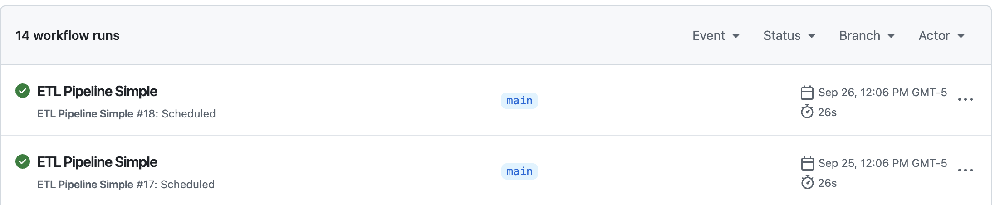

# Laboratorio 2 - Pipeline ETL Automatizado
## Extracción, Transformación y Carga de Datos.

**Estudiantes:** Nylho Antonio Dorado/Javier Teran/ Miguel Lozano / Kevin Jaramillo 
**Materia:** ETL


---

## Resumen Ejecutivo

Este proyecto implementa un pipeline ETL completo para el procesamiento automatizado de datos. El sistema procesa información de alumnos, calificaciones y matrículas, transformándola en un dataset consolidado y almacenándola en una base de datos SQLite con monitoreo completo de las ejecuciones.

## Objetivos Cumplidos

✅ **Pipeline ETL funcional** con extracción, transformación y carga de datos  
✅ **Automatización completa** mediante GitHub Actions  
✅ **Sistema de monitoreo** con tabla `etl_monitor` para métricas de ejecución  
✅ **Persistencia de logs** para trazabilidad completa  
✅ **Programación automática** con ejecución diaria  
✅ **Manejo robusto de errores** y recuperación  

## Arquitectura del Sistema

### Estructura del Proyecto
```
prefect_lab2/
├── flows/
│   ├── etl_simple.py           # Pipeline ETL principal
│   
├── data/
│   ├── alumnos.csv             # Datos de estudiantes
│   ├── calificaciones.json     # Notas por materia
│   ├── matriculas.xml          # Información de matrículas
│   ├── etl.db                  # Base de datos SQLite
│   ├── etl.log                 # Logs acumulativos
│   └── df_final.csv            # Dataset consolidado
├── .github/workflows/
│   └── etl-simple.yml          # Automatización CI/CD
└── requirements.txt            # Dependencias Python
```

### Componentes Principales

1. **Extractor de Datos**: Procesa archivos CSV, JSON y XML
2. **Motor de Transformación**: Normaliza y consolida información
3. **Cargador**: Persiste datos en SQLite y archivos CSV
4. **Monitor de Ejecución**: Registra métricas en tabla `etl_monitor`
5. **Automatizador**: GitHub Actions para ejecución programada

## Funcionalidades Implementadas

### 1. Extracción de Datos (Extract)
- **Fuentes múltiples**: CSV, JSON, XML
- **Validación de archivos**: Verificación de existencia y formato
- **Generación de copias raw**: Respaldo de datos originales
- **Métricas de extracción**: Conteo de registros por fuente

### 2. Transformación de Datos (Transform)
- **Limpieza de duplicados**: Eliminación por `id_alumno`
- **Generación de correos**: Creación automática para registros faltantes
- **Normalización de calificaciones**: Ajuste al rango 0-5
- **Consolidación de datos**: Merge inteligente por clave primaria
- **Validación de integridad**: Verificación de relaciones

### 3. Carga de Datos (Load)
- **Base de datos SQLite**: Tabla `hechos` con datos consolidados
- **Archivo CSV**: `df_final.csv` para análisis externos
- **Tabla de monitoreo**: `etl_monitor` con métricas de ejecución
- **Verificación de carga**: Conteo de registros insertados

### 4. Sistema de Monitoreo
La tabla `etl_monitor` registra las siguientes métricas por cada ejecución:

| Campo | Descripción |
|-------|-------------|
| `run_ts` | Timestamp de ejecución |
| `registros_leidos` | Total de registros extraídos |
| `registros_validos` | Registros procesados exitosamente |
| `registros_descartados` | Registros con errores |
| `alumnos_con_matricula` | Estudiantes con matrícula asociada |
| `total_alumnos_unicos` | Alumnos únicos en el dataset |
| `correos_generados` | Correos creados automáticamente |
| `promedio_notas_general` | Promedio de calificaciones |
| `duracion_s` | Tiempo de ejecución en segundos |
| `estado` | Estado de la ejecución (OK/FAIL) |

## Automatización y Programación

### GitHub Actions Workflow
- **Ejecución diaria**: Programada para las 12:00 PM COT
- **Ejecución manual**: Disponible mediante `workflow_dispatch`
- **Persistencia automática**: Commit de `etl.db` y `etl.log` al repositorio
- **Monitoreo de estado**: Verificación de archivos y métricas

### Configuración de Horarios
```yaml
schedule:
  - cron: '0 17 * * *'  # 12:00 PM Colombia (UTC-5)
```

## Manejo de Errores y Recuperación

### Estrategias Implementadas
1. **Try-catch por fase**: Captura específica de errores
2. **Logging detallado**: Registro de errores con contexto
3. **Métricas de fallo**: Registro en `etl_monitor` con estado FAIL
4. **Rollback automático**: Mantenimiento de integridad de datos
5. **Notificación**: Logs visibles en GitHub Actions

### Casos de Error Manejados
- Archivos fuente faltantes o corruptos
- Errores de formato en datos
- Problemas de conectividad a base de datos
- Fallos en transformaciones de datos
---

**Nota**: Este sistema está en producción con ejecución diaria automática. Los datos y métricas se actualizan continuamente en el repositorio para demostrar la funcionalidad completa del pipeline ETL. En el registro de ejecuciones de Actions se evidencian ejecuciones manuales y automatizadas.

## Evidencia de Ejecucion Automatica Exitosa

